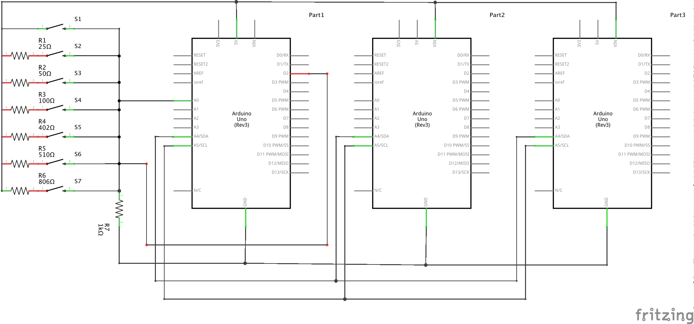

# MorseCode
# This project contains a script that must be uploaded to an arduino where it will then be executed 

- Schematic of the circuit used with the adrduino is shown below
- The time between button presses is encoded as a 1 or 0
- each "message" starts with a number id to identify the arduino 
recieving the message from the button inputs
- The central arduino then takes the inputs and generates an encryted 
message and outputs the signal to the recieving arduino. Signals are send 
from one "computer" to another using voltage fluctuations lasting for a 
variable time (0.01 seconds for a 1 and 0.03 seconds for a zero)
- The inital and encrpyted messages are displayed in LED lights in the 
configuration below.
- The arduinos use a physical port and wire connections to identify 
adjacent arduinos and then send message accordingly
- Encryption algorithm takes the XOR of the arduino number id 
(public key) to encrypt and decrypt messages
                  
             
This project contains a communication protocol that encrypts in Morse code signals using
symmetric-key cryptography, and it transmit data to connected ardunios using internal timers and interrupts

